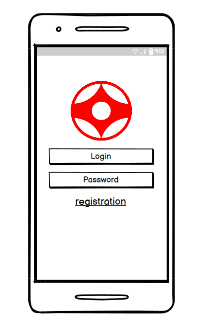
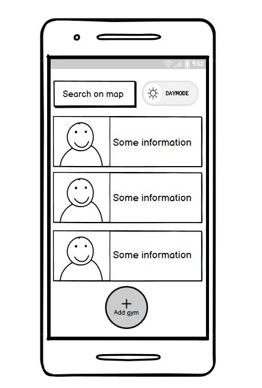
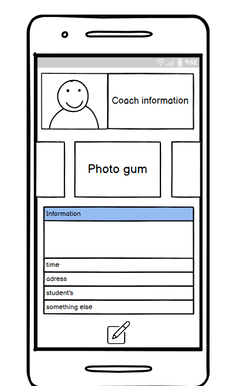
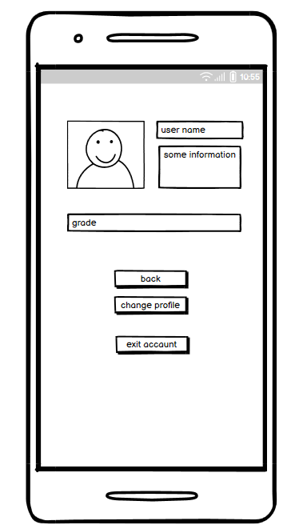

# Karate-Gym-Tracker

## **Оглавление**
- [1. Введение](#intro)
- [2. Требования пользователя](#user_requirements)
  - [2.1 Программные интерфейсы](#interfaces)
  - [2.2 Интерфейс пользователя](#ui)
  - [2.3 Характеристики пользователей](#user_characteristics)
  - [2.4 Предположения и зависимости](#assumptions)
- [3. Системные требования](#system_requirements)
  - [3.1 Функциональные требования](#functional_requirements)
  - [3.2 Нефункциональные требования](#non_functional_requirements)

## **1. Введение**

**Название проекта:** Karate Gym Tracker

**Технологии и инструменты разработки:**

• Язык разработки: Kotlin.

• Фреймворк для создания UI: Jetpack Compose.

• Среда разработки: Android Studio.

**Описание проекта:**  
Проект представляет собой мобильное приложение для учёта залов по карате. Пользователи смогут хранить информацию о залах, тренерах и учениках, времени тренировок, а также управлять своими профилями через личный кабинет.

**Границы проекта:**  
Приложение не предоставляет функций онлайн-тренировок, видеозаписей занятий или финансового учёта.

## **2. Требования пользователя**

### **2.1 Программные интерфейсы:**

Продукт будет взаимодействовать с несколькими внешними системами:

• Firebase Authentication для авторизации и хранения данных пользователей (тренеров, администраторов).

• Room Database для локального хранения информации о залах, тренерах и учениках.

### **2.2 Интерфейс пользователя:**

Приложение будет содержать следующие основные интерфейсы:

• Страница авторизации: Экран для ввода данных пользователя (логин и пароль).
  
  

• Главная страница: Список залов с возможностью добавления и редактирования информации.
  
  

• Страница профиля зала: Информация о тренере, учениках, времени тренировок и адрес зала.
  
  

• Личный кабинет: Профиль пользователя с возможностью редактирования личной информации, загрузки фото и изменения данных о залах.
  
  

Пример взаимодействия:

| Действие пользователя                          | Реакция системы                                               |
|------------------------------------------------|---------------------------------------------------------------|
| Ввод логина и пароля, нажимает "Войти"         | Проверка данных и вход в систему                              |
| Нажимает на зал в списке                       | Открывается страница с информацией о зале и его учениках       |
| Нажимает на кнопку "Личный кабинет"            | Открывается профиль пользователя с возможностью редактирования |
| Проведение свайпа по залу                      | Возможность редактирования или удаления записи                 |

### **2.3 Характеристики пользователей:**

• Тренеры и администраторы залов: Возраст 25-50 лет, с базовыми навыками работы со смартфонами. Уровень технической грамотности — средний.

• Ученики: Молодёжь от 10 лет, большинство из которых имеют высокий уровень владения смартфонами. Могут использовать приложение для просмотра информации о тренировках и своём зале.

### **2.4 Предположения и зависимости:**

• Все пользователи должны иметь подключение к интернету для синхронизации данных с облаком.

• Приложение будет работать только на устройствах с Android 6.0 и выше.

## **3. Системные требования**

### **3.1 Функциональные требования:**

1. Приложение должно позволять пользователям (администраторам) добавлять, редактировать и удалять записи о залах.
  
2. Пользователи должны иметь возможность добавлять и редактировать информацию о тренерах и учениках.
	
3. Пользователи должны иметь доступ к личному кабинету для редактирования своих данных и управления залами.
	
4. Авторизация через Firebase должна быть обязательной для всех пользователей.
	
5. Приложение должно поддерживать управление жестами для выполнения определённых действий, таких как редактирование или удаление залов.
   
6. Приложение должно поддерживать синхронизацию данных с облаком (Firebase).

7. Поддержка темной и светлой темы интерфейса.

### **3.2 Нефункциональные требования:**

• Надёжность: Приложение должно быть устойчивым к потерям соединения с интернетом, с возможностью локального хранения данных и последующей синхронизации.

• Безопасность: Данные пользователей и залов должны быть защищены, а авторизация — проводиться через надёжную систему (например, Firebase Authentication).

• Производительность: Приложение должно загружаться и работать плавно на большинстве современных устройств.

• Удобство использования: Интерфейс должен быть интуитивно понятным, особенно для пользователей с базовыми техническими навыками.
